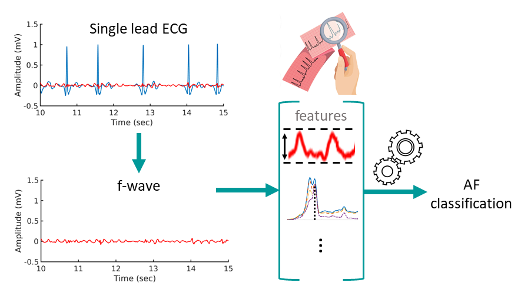

# Machine Learning for Ranking f-wave Extraction Methods in Single-Lead ECGs

## Overview

This repository contains MATLAB code and resources for the paper titled **"Machine Learning for Ranking f-wave Extraction Methods in Single-Lead ECGs"**. This research investigates various f-wave extraction methods for single-lead ECGs and utilizes machine learning to rank these methods based on their performance.

<p align="center">

</p>

> 🌟 If you find this resource helpful, please consider to star this repository and cite our research:

```
@article{benmoshe2024MLfwaves,
  title={Machine learning for ranking f-wave extraction methods in single-lead ECGs},
  author={Ben-Moshe, Noam and Biton, Shany and Tsutsui, Kenta and Suleiman, Mahmoud and S{\"o}rnmo, Leif and Behar, Joachim A},
  journal={biomedical signal processing and control},
  year={2024}
}
```

## Table of Contents

1. [Introduction](#introduction)
2. [Requirements](#requirements)
3. [Installation](#installation)
4. [Usage](#usage)
5. [Data](#data)
6. [Contributing](#contributing)


## Introduction

The project includes MATLAB scripts for evaluating and ranking different f-wave extraction methods. The code calculates features from ECG data, evaluates four f-wave extraction methods, and applies a Random Forest model to determine the best-performing method.
The presence of fibrillatory waves (f-waves) is important in the diagnosis of atrial fibrillation (AF), which has motivated the development of methods for f-wave extraction. We propose a novel approach to benchmarking methods designed for single-lead ECG analysis, building on the hypothesis that better-performing AF classification using features computed from the extracted f-waves implies better-performing extraction. The approach is well-suited for processing large Holter data sets annotated with respect to the presence of AF. Methods: Three data sets with a total of 300 two- or three-lead Holter recordings, performed in the USA, Israel and Japan, were used as well as a simulated single-lead data set. Four existing extraction methods based on either average beat subtraction or principal component analysis (PCA) were evaluated. A random forest classifier was used for window-based AF classification. Performance was measured by the area under the receiver operating characteristic (AUROC). Results: The best performance was found for PCA-based extraction, resulting in AUROCs in the ranges 0.77--0.83, 0.62--0.78, and 0.87--0.89 for the data sets from USA, Israel, and Japan, respectively, when analyzed across leads; the AUROC of the simulated single-lead, noisy data set was 0.98. Conclusions: This study provides a novel approach to evaluating the performance of f-wave extraction methods, offering the advantage of not using ground truth f-waves for evaluation, thus being able to leverage real data sets for evaluation. 
## Requirements

To run the MATLAB code, you will need:

- MATLAB

## Installation

Clone the repository to your local machine:

```bash
git clone https://github.com/noambenmoshe/fwave.git
cd fwave
```

## Usage

1. **Data Preparation:**
   
   Place your dataset in the databases/ directory. The dataset should be formatted according to the examples provided.

3. **Running the Analysis:**
   
   Open MATLAB and navigate to the directory containing the cloned repository.
Run the main program script:
```bash
MAIN_PROGRAM
```
The [MAIN_PROGRAM.m](MAIN_PROGRAM.m) script includes an example of how to use the data and evaluate the four f-wave extraction methods. It calculates features for each ECG example and for each extraction method and saves them.

3. **Training and Evaluating the Random Forest Model:**
   
   After running the MAIN_PROGRAM.m script, the features will be saved. These features from each extraction method can be used as input to a Random Forest model that classifies if the ECG example is labled as Atrial Fibrilation or not. 
The modle that will get the highest area under the receiver operating characteristic (AUROC) is the best extraction method.

## Data

The data examples in the database folder are 1 minuet windows from the public [database](databases) JPAFDB that was used in the paper.
For more information about this database you can visit the paper: [SHDB-AF: a Japanese Holter ECG database of atrial fibrillation](https://www.researchgate.net/publication/381704611_SHDB-AF_a_Japanese_Holter_ECG_database_of_atrial_fibrillation)


## Contributing

 Do you have anything to add or fix? I'll be happy to talk about it! Open an issue/PR :)
